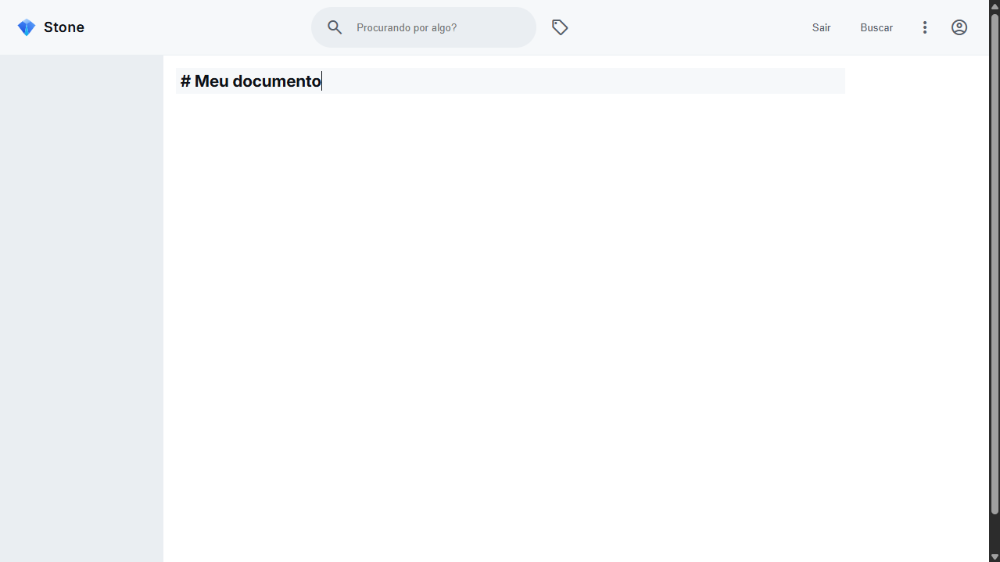

# Stone
Document processes, record knowledge.

## 🛠️ Technologies Used

The software is still in the early stages of development.

- [ ] citação
- [ ] criar tags #tag
- [ ] organização hierárquica dos títulos no documento
- [ ] salvar documentação
- [ ] organização hierárquica dos documentos no menu
- [ ] poder fazer busca geral, ou por tags
- [ ] links internos entre páginas
- [ ] abrir pdf
- [ ] gráficos de fluxo
- [ ] cadastro por usuário
- [ ] permissões de visualização do documento
- [ ] poder editar as cores do tema e salvar no localStorage
- [ ] grafo com todos os documentos e seus relacionamentos por links internos